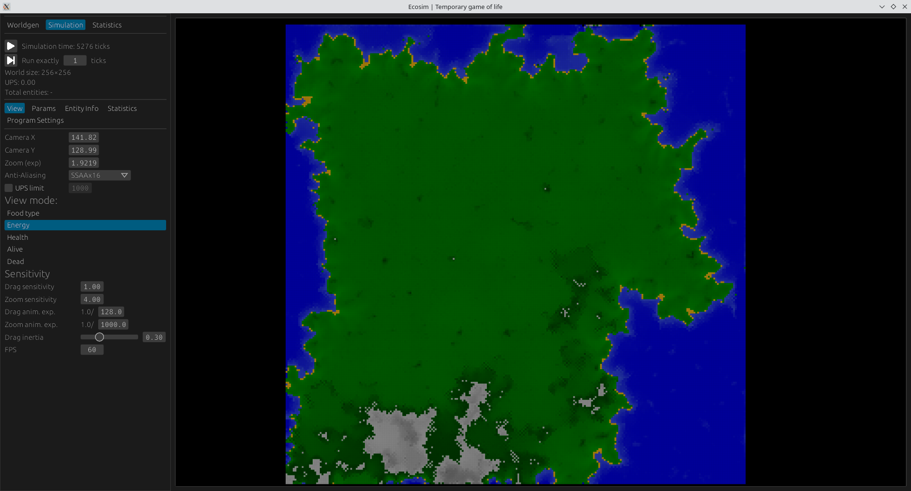
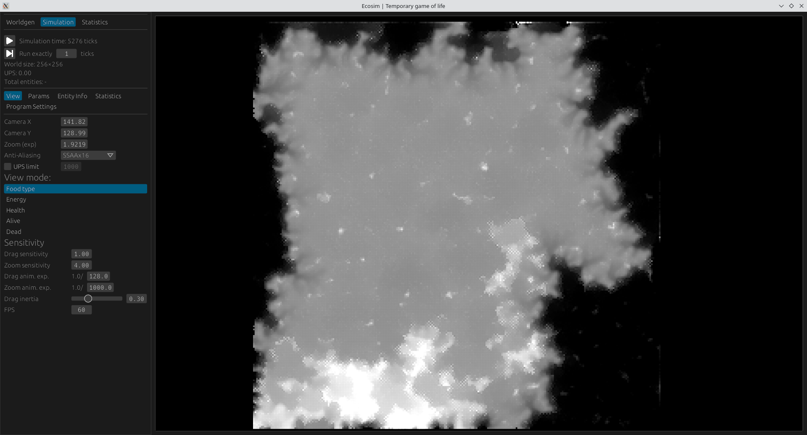
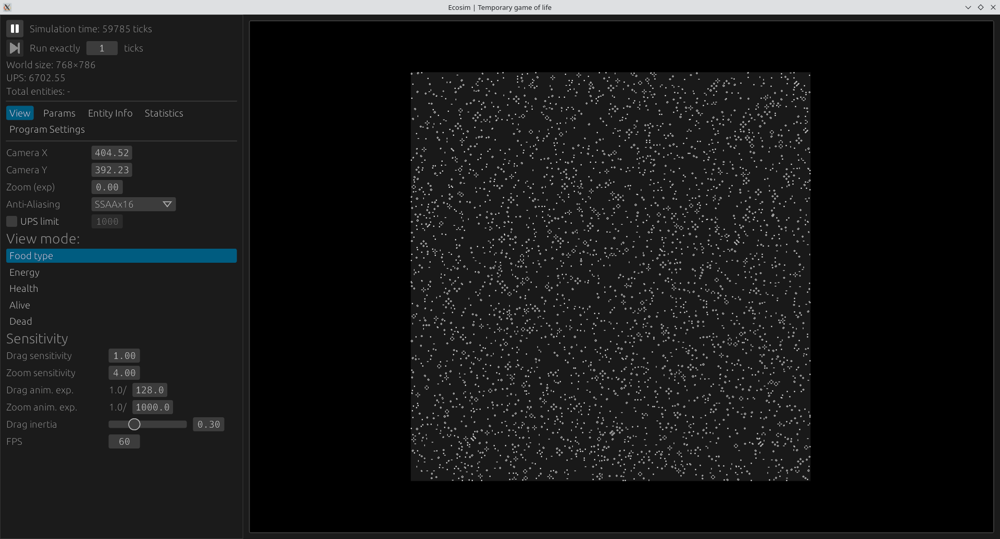
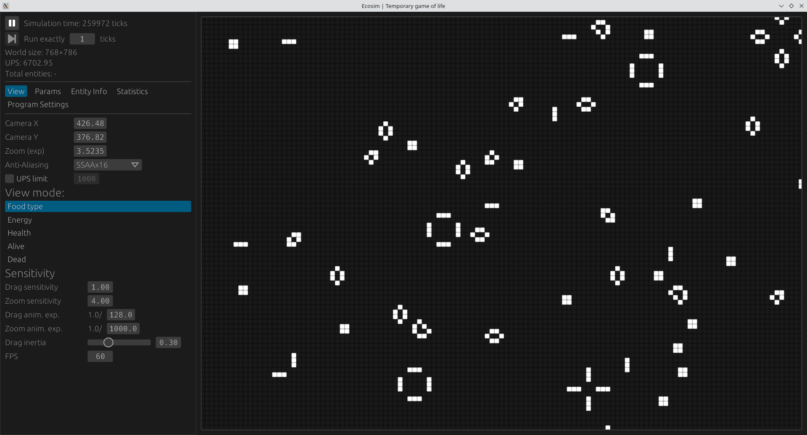

# ecosim_rust

## Intro

To-be-evolution simulation written in Rust (GLSL actually because of compute shaders).

Currently it is a landscape erosion simulation on branch `use_sdl2`, and
Game Of Life compute shaders GPU simulation (very high performance) on `master` branch.

Heavily Work-In-Progress

## How to run 

***To run it on your machine***, use:
```
git clone https://github.com/USSURATONCACHI/ecosim_rust.git
cd ecosim_rust
git checkout use_sdl2
git submodule init
git submodule update
cargo run
```
You have to have rust installed. First compilation will take a while, because of dependecies

## Screenshots

### Landscape erosion simulation:



### Game of life:

You can see, that on RTX 3050 mobile, field 768*768 cells is being simulated in almost 7k updates per second! That is the point of why GPU is used here.


